# ComfyUI Krea2 Style Transfer

Training-free local style reference nodes for Krea2 in ComfyUI.

[中文说明](README_CN.md)

This project adds local style-reference behavior to open-source Krea2 workflows. It is not the official Krea style reference module and does not call the official API. It is an independent ComfyUI implementation that injects reference-image style signals during sampling.

The main goal is simple:

> Transfer the visual style of a reference image while keeping the new prompt content, with no visible content leakage and minimal quality loss.

In single-image reference cases, the behavior is close to a temporary training-free style adapter: similar in use to a style LoRA, but without training a LoRA, preparing a dataset, or changing model weights.

## What This Solves

The open-source Krea2 model does not currently include the official Style Reference module. Common alternatives have clear drawbacks:

- Image-to-image often changes the subject, layout, or composition.
- Prompt-based style extraction depends heavily on VLM wording and works less directly.
- Early reference-injection routes could transfer style, but often caused content leakage, dirty textures, lower image quality, or too many hard-to-tune controls.

This node focuses on a more practical route:

- Single-reference style transfer that preserves Krea2's native visual quality.
- No visible reference-content leakage in the tested single-reference examples.
- Strong transfer of linework, color palette, texture, rendering language, and overall visual style.
- A simple `recommended` mode for normal use, plus `custom` mode for experiments.
- Optional two-reference mode for controlled experiments.

## Core Technical Idea

The key discovery is the relationship between `low_scale_end` and `ref_k_strength`.

In reference-injection routes, `low_scale_end` strongly affects the balance between style transfer, quality, and leakage:

- Higher `low_scale_end`: style transfers more easily, but reference content can leak in and image quality can degrade.
- Lower `low_scale_end`: image quality improves and content leakage is reduced, but the reference style can disappear.

This project introduces an independent `ref_k_strength` control for the reference K path.

That decouples two things that were previously tied together:

- `low_scale_end` keeps content leakage low and preserves image quality.
- `ref_k_strength` re-activates the reference style signal while `low_scale_end` stays low.

This is the core improvement. It allows Krea2 to keep a low-leakage, high-quality setting while still transferring the reference image's style.

In plain terms:

> `low_scale_end` suppresses unwanted reference-content leakage. `ref_k_strength` brings the style back.

## Single-Image Results

These examples use one reference image and a different text prompt. The output follows the prompt content while inheriting the reference style.

<p>
  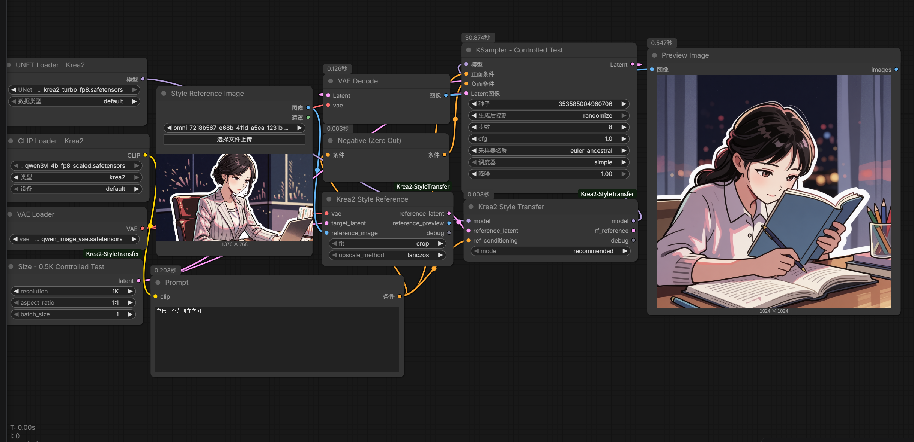
  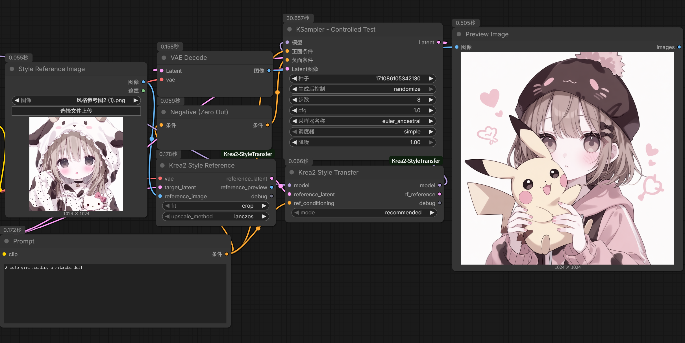
</p>
<p>
  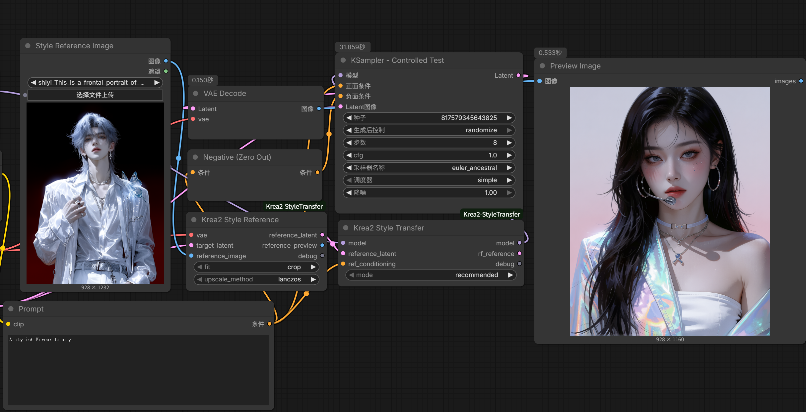
  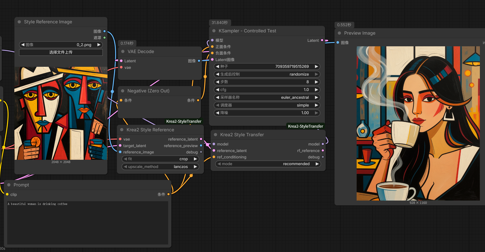
</p>

## Nodes

### `Krea2 Style Reference`

Prepares one reference image for style transfer.

Inputs:

- `vae`
- `target_latent`
- `reference_image`

Outputs:

- `reference_latent`
- `reference_preview`
- `debug`

Use the same target latent that will feed the sampler. The reference is adapted to the target latent size so the style path matches the current generation.

### `Krea2 Style Transfer`

Main single-image style transfer node.

Inputs:

- `model`
- `reference_latent`
- `ref_conditioning`
- `mode`

`recommended` mode uses the tuned low-leakage route. `custom` mode exposes advanced controls, including `ref_k_strength`, `low_scale_end`, and related RF/attention parameters.

### `Krea2 Two Style References`

Bundles two prepared style reference latents.

This node intentionally supports two references only. See the multi-reference notes below.

### `Krea2 Two Style Transfer`

Experimental two-reference style transfer.

Inputs include:

- `primary_reference`
- `ref_k_1`
- `ref_k_2`
- `first_phase_ratio`

`primary_reference` selects which reference enters the first, longer style stage. With the recommended `first_phase_ratio = 0.75`, this usually makes that image the main visual anchor.

### `Krea2 Size Preset`

Convenience latent-size node with common Krea2 sizes and aspect ratios.

## Recommended Single-Reference Settings

The default `recommended` mode currently locks the tested route:

```text
style_strength: 1.00
ref_k_strength: 1.06
ref_value_mix: 1.00
value_adain_strength: 0.65
rf_mode: flowturbo_pc
gamma: 0.50
beta: 2.50
high_scale_start: 1.04
high_scale_end: 0.00
low_scale_start: 1.00
low_scale_end: 1.10
adain_strength: 0.85
blocks: 7-27
```

Suggested sampler:

```text
steps: 8
cfg: 1.0
sampler: euler_ancestral
scheduler: simple
denoise: 1.0
```

## Two-Reference Mode

Two-reference transfer is intentionally limited to two images.

In this training-free route, references are not fused by a trained official style module. Each image brings its own style signal into the K/V path. With two references, the result is still reasonably controllable: one image can provide the main style direction while the other contributes secondary palette, linework, texture, or atmosphere.

With three or more references, the signals tend to compete rather than blend cleanly. In testing this often caused weaker style transfer, quality loss, unstable dominance by one reference, or results that were difficult to explain. Two references are the practical limit for this route.

### Stage-Based Blending

Two-reference mode is stage-based, not a simple weighted average.

The selected `primary_reference` enters the first style stage. The other reference enters the later stage. Early tests used a 50/50 split, but that was not visually balanced: later sampling steps have stronger influence on final outlines, colors, texture, and surface details, so the second-stage reference often looked too dominant.

The recommended preset now uses:

```text
first_phase_ratio: 0.75
```

This gives the primary reference a longer first stage while still allowing the secondary reference to affect the final look. In practice, `0.75` produced a more balanced two-reference blend than `0.50`.

Useful range:

```text
0.70 - 0.80
```

- Lower values preserve more of the second-stage reference.
- Higher values give the first-stage reference more visible influence.
- `0.90` is usually too high and can make the blend feel one-sided.

### Stage Ratio Test

The references below were used for the stage-ratio tests:

<p>
  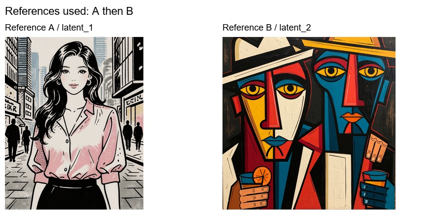
</p>

The rows compare `primary_reference = 1` and `primary_reference = 2`. The columns compare different `first_phase_ratio` values.

<p>
  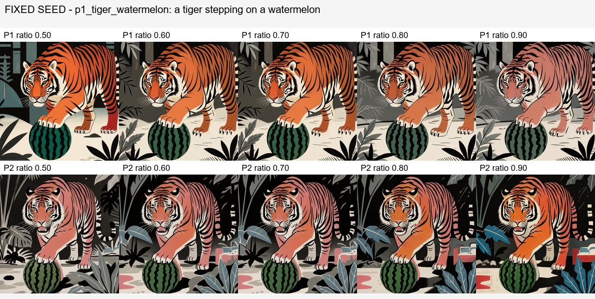
</p>

<p>
  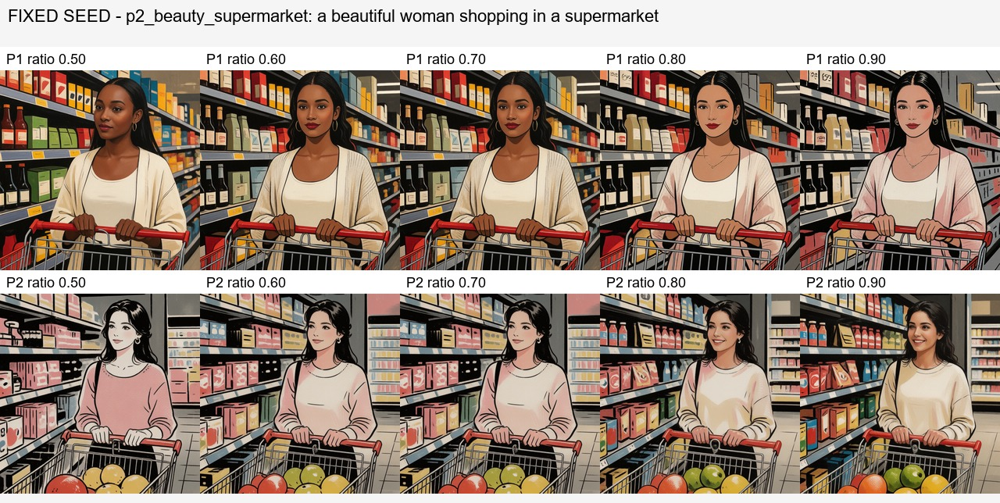
</p>

A narrower probe around `0.70 / 0.75 / 0.80` showed that `0.75` is a strong default:

<p>
  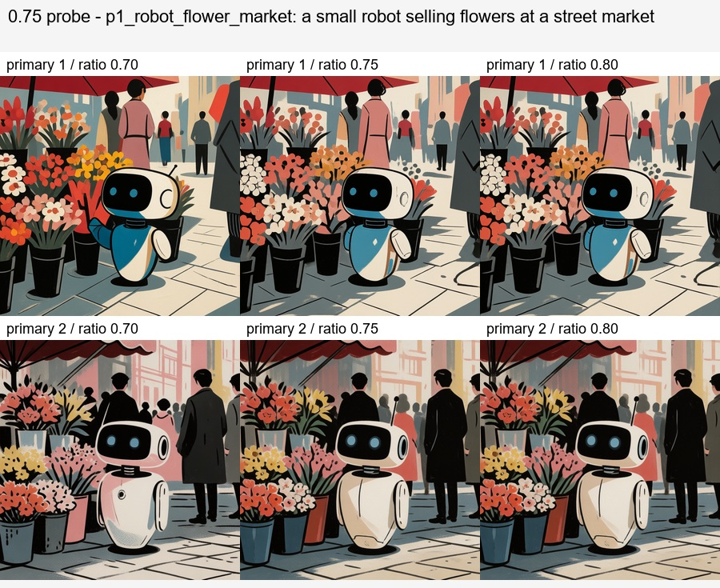
</p>

<p>
  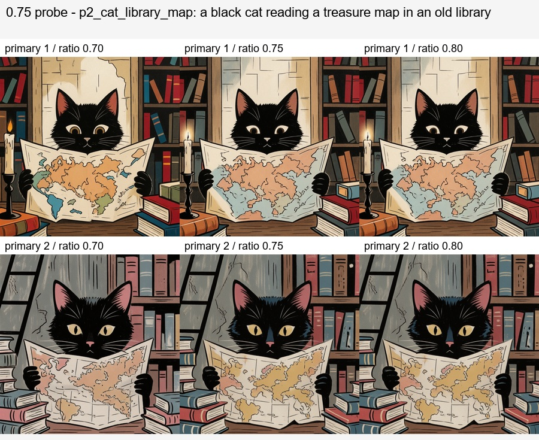
</p>

### Why `primary_reference` Exists

`primary_reference` does not mean "copy this image". It selects which reference enters the first, longer style stage.

With the recommended `first_phase_ratio = 0.75`, the primary reference usually acts as the main visual anchor. The secondary reference still participates in the later stage and can influence color accents, edge treatment, texture, background tendency, or overall atmosphere.

This is why two-reference output is order-sensitive. The route is better understood as an ordered, stage-based style blend rather than a uniform average.

### Two-Reference Order Examples

Each pair below uses the same references and prompt, but swaps which reference is primary.

<p>
  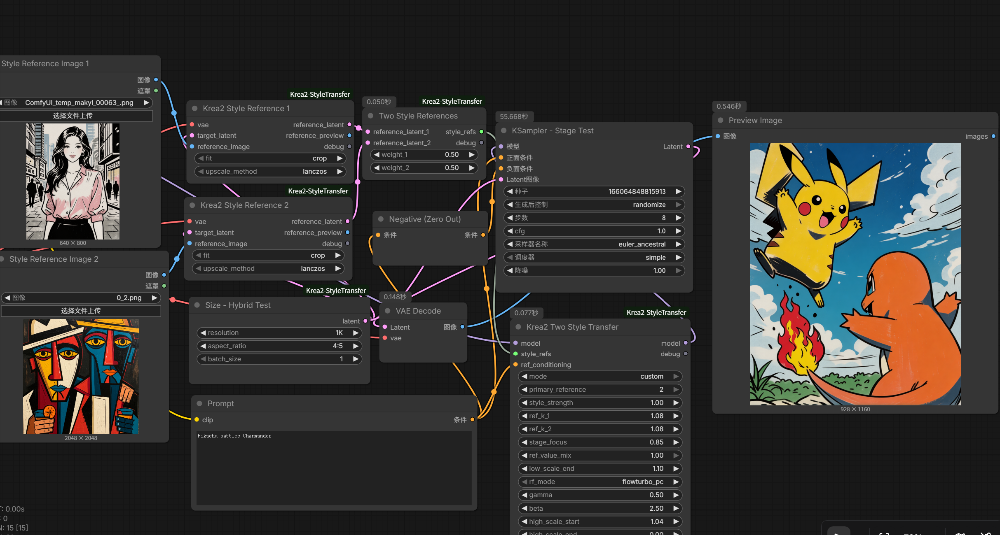
  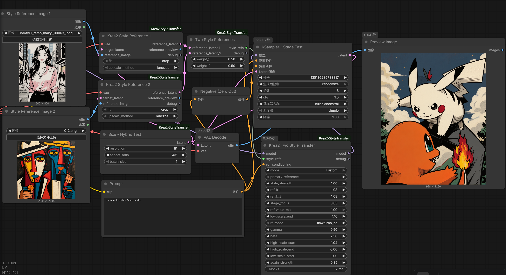
</p>
<p>
  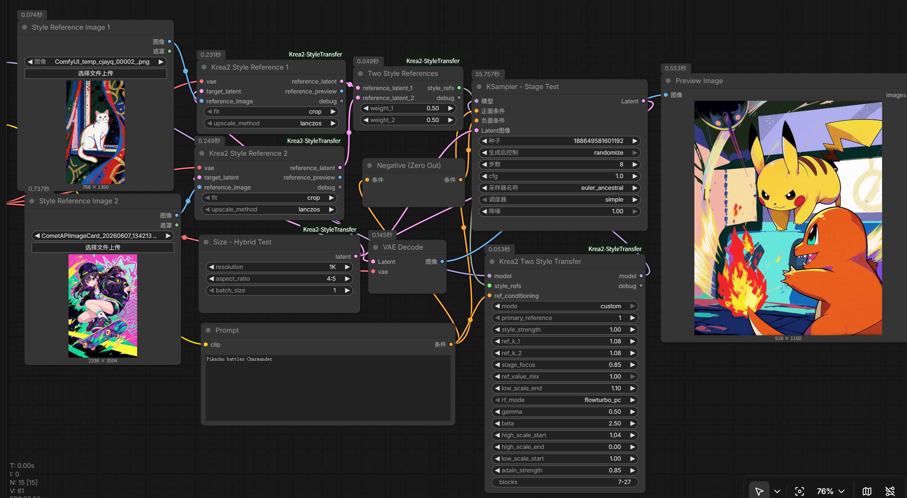
  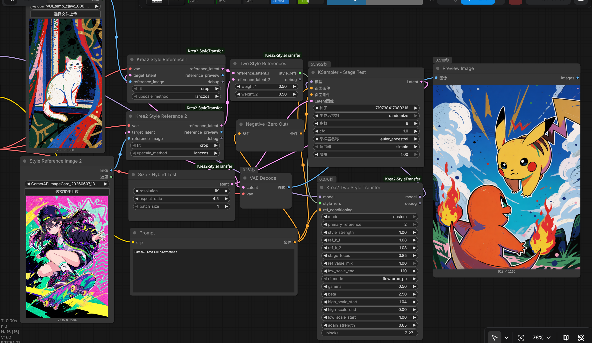
</p>

## Possible Similarity To Official Reference Ordering

This project does not claim to reproduce the official Krea style reference module.

However, official Krea2 multi-reference results can also show split behavior inside a four-image batch: some outputs visibly follow one reference direction, while others follow another. This suggests that the official system may also have some form of ordered, routed, or stochastic reference influence rather than a perfectly uniform average.

The screenshot below is included only as an observation, not proof of the official implementation.

<p>
  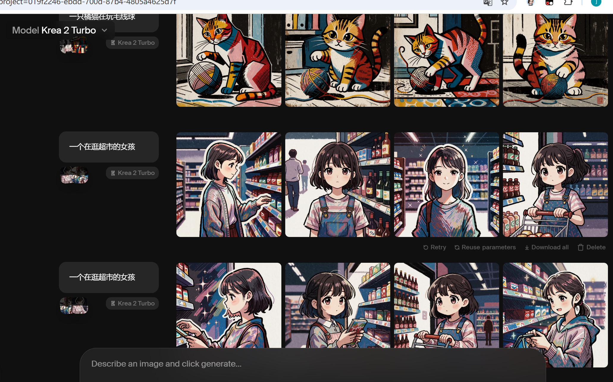
</p>

Our two-reference route may have touched part of a similar principle: references can act as separate style signals, and the result may depend on routing, order, or sampling dynamics.

## What Is New Here?

- Independent ComfyUI implementation. No dependency on third-party style-transfer nodes.
- A practical low-leakage single-reference preset.
- Independent `ref_k_strength` control for the reference K path.
- A tuned low `low_scale_end` route to preserve quality and suppress reference-content leakage.
- Two-reference experimental route with explicit `primary_reference`.
- Stage-ratio control for two-reference blending, with `first_phase_ratio = 0.75` as the recommended default.
- Simplified UX: `recommended` for normal users, `custom` for parameter experiments.

## Limitations

- This is not the official Krea style reference module.
- It is not a full LoRA replacement. It behaves like a training-free temporary style adapter in many single-reference cases, but it does not train or store a reusable style in model weights.
- Single-reference transfer is currently the strongest and most stable route.
- Two-reference transfer is experimental, order-sensitive, and stage-ratio-sensitive.
- Very weak or generic references may not produce a strong style signal.
- Reference and target latent sizes must match for the current route.

## Installation

Clone or copy this folder into ComfyUI's `custom_nodes` directory:

```text
ComfyUI/custom_nodes/ComfyUI-Krea2-StyleTransfer
```

Restart ComfyUI.

The project only provides custom nodes. You still need a working Krea2 ComfyUI setup with the correct Krea2 UNet, VAE, and text encoder models.

## Suggested Workflows

Two example workflows are included alongside this project:

- `workflows/Krea2 Style Transfer.json`
- `workflows/Krea2 Two Style Transfer.json`

Use the single-reference workflow first. It is the main supported path.

## Credits And Notes

This project was developed through practical experiments on local Krea2 workflows. It is inspired by public community discussion around Krea2 reference injection and RoPE/K-V style transfer ideas, but the node code, UX, tuned defaults, and `ref_k_strength`-based low-leakage route are implemented independently in this project.
